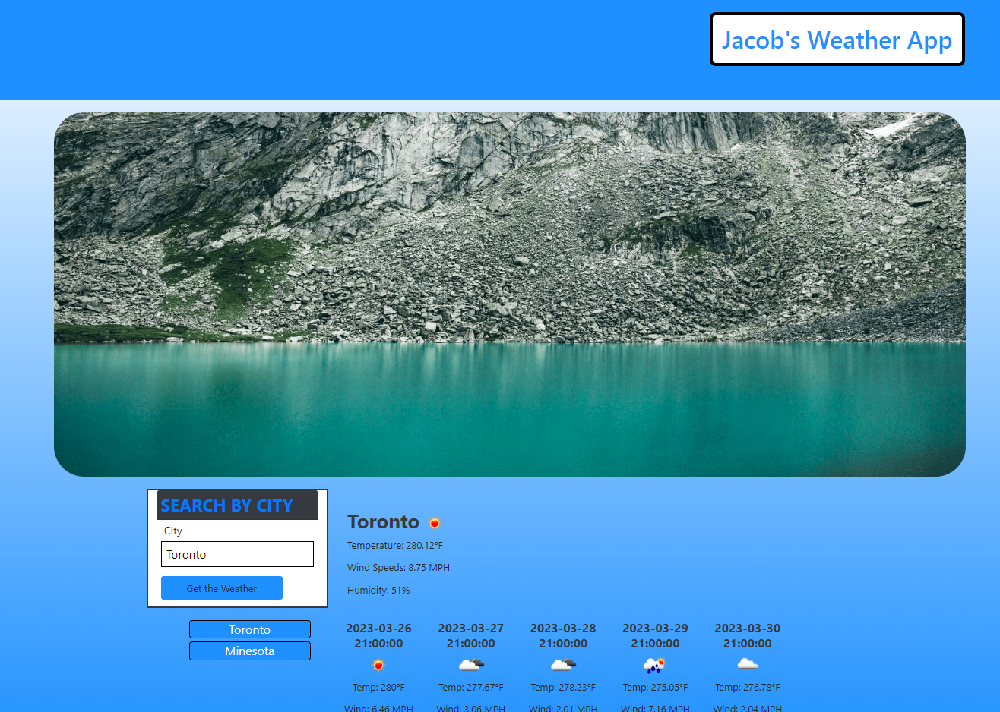

# Jacob Weather App
## Description

In this assignment you will find a weather app. This weather app displays the current temperature, humidity, and wind speed of a specific city. As well, you can find the following information for the next 5 days of the city.

## Link
https://jacobpostill.github.io/Jacob-Weather-App/

## Instructions

To use this application, type the name of the city you are looking for in the search bar on the left. Following that click the blue button below or enter and the current clinate information, as well as the information for the next 5 days will appear. Following searching a city, the city will be store below the searchbar for future use. 

